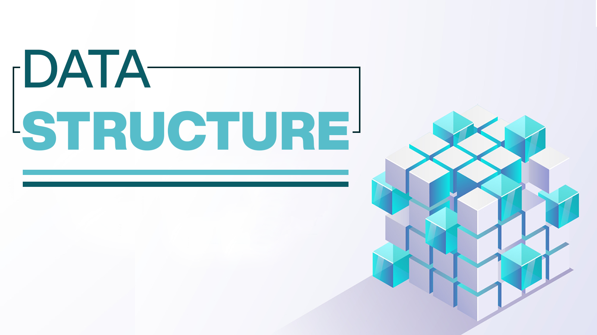

# Data-Structures

What are data structures and algorithms?

**Data organizations** are ways data is arranged in the computer using its various storage media (such as random-access memory, or RAM, and disk) and how that data is interpreted to represent something. 

**Algorithms** are the procedures used to manipulate the data in these structures. The way data is arranged can simplify the algorithms and make algorithms run faster or slower. 
The algorithm specifies the sequence of operations that are to be performed

Together, the data organization and the algorithm form a **data structure**.

Data structures are important not just for speed but also to properly model the meaning of the data.

Four operations are needed for almost every data structure that manages a large collection of similar items:
- insertion (add),
- deletion (remove),
- search (find),
- traversal (list).

Data Structure: 

- Array
- Ordered array
- Stack
- Queue
- Linked list
- Binary tree
- Red-Black tree
- 2-3-4 tree
- Quad tree
- Hash table
- Graph

